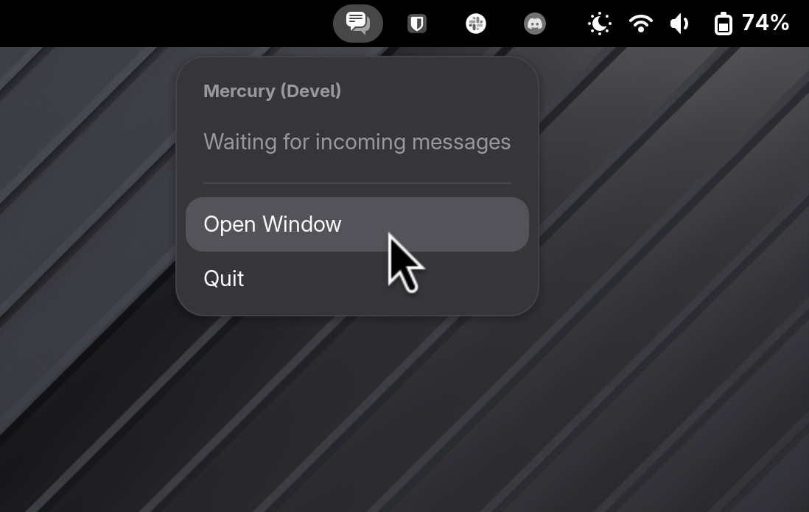

# Background App Icons

**Show Background Apps in the top bar with an icon and menu for quick access to actions**



GNOME Shell supports background apps through the xdg-desktop-portal. People complain about not having status icons for their apps. This extension just shows those same background apps directly top bar, in case that's your thing.

Hovering an app icon shows a tooltip with its name. Selecting the icon shows its status and menu items to open a window or quit the app. Everything you can already do from the Background Apps menu, but right on the top bar.

## TODO

See the [open issues](https://github.com/cassidyjames/background-app-icons/issues) for everything, but in general, I'd like to focus on:

1. Exposing more useful actions in the menu, i.e. static desktop actions and eventually dynamic actions if it's not too hard.
   - #4
   - #5 
2. Handling the too-many-icons case, e.g. by making the area collapsible and/or having a concept of hidden/pinned icons.
   - #1
3. Exploring other "system tray" like interactions, but using all the modern APIs we already have.
   - #2
   - #3
   - #6

## Requirements

GNOME Shell 50

## Installation

Copy or symlink the extension directory to `~/.local/share/gnome-shell/extensions/background-app-icons@cassidyjames.com`, then enable it:

```sh
gnome-extensions enable background-app-icons@cassidyjames.com
```
